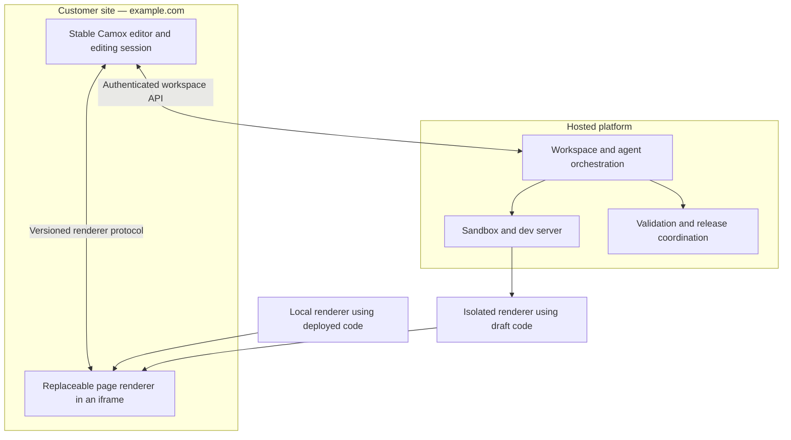

# RFC: In-site AI editing platform

## Status

Vision / proposed architecture. Not shipped behavior. The first milestone is a
renderer hot-swap prototype, not a full platform implementation.

The first platform version has one shared workspace per site. Independent
concurrent initiatives come later; workspace identity and versioning must not
assume that a site can only ever have one workspace.

## Product intent

Generate and edit Camox sites through one embedded agent chat, without exposing
code, terminals, or a separate platform preview experience. The target audience
is marketing teams, which need control over what goes live and when.

- Users stay on their site's URL with Camox's management UI.
- Content and code changes share one publication workflow, not an unconditional
  “publish every draft” action.
- Publish selected content together with all pending code in the active
  workspace. Keep optional content scope and wider impact explicit.
- Permissions may distinguish content editing, code editing, and publishing;
  users should not have to choose different tools or apps.
- No top-level reloads for runtime transitions. Keep the editor and conversation
  mounted while replacing the page renderer.
- An internal iframe is acceptable as a rendering and isolation boundary.

## Architecture

Separate the stable editor from the replaceable site renderer.



The editor owns chat, selection, navigation context, publishing, and recovery.
The renderer executes site blocks, layouts, styles, and page behavior. A broken
renderer must not take down the editor.

Existing canvas frames use local documents and React portals. A remote renderer
must be autonomous; changing an iframe URL alone is insufficient. Direct frame
DOM access must move into the renderer or become protocol messages.

## Drafts select code and content together

**Viewing a draft selects its code + content. Edit mode only reveals controls.**

Authenticated users already see draft content when opening their site. A unified
draft must also show its code changes immediately, before edit mode opens.

| View                    | Code      | Content   | Initial implementation |
| ----------------------- | --------- | --------- | ---------------------- |
| Published site          | Published | Published | Local renderer         |
| Content-only draft      | Published | Draft     | Local renderer         |
| Draft with code changes | Draft     | Draft     | Sandbox renderer       |

Resolve authorization and the active workspace before choosing the initial
renderer. Do not briefly display published code as if it were the draft. If the
draft renderer is unavailable, show an explicit preparation/recovery state.

Opening edit mode should prepare the editing session, not unconditionally start
a sandbox. Content-only editing remains local. Provision or resume compute when
viewing an existing code draft or when a new change requires code.

Leaving edit mode does not implicitly switch back to published code.

## One reusable renderer handoff

**Prepare → ready → restore state → reveal → dispose previous renderer.**

1. Keep the outgoing view and editor usable while preparing the replacement.
2. Load the incoming renderer invisibly with real viewport geometry.
3. Require application readiness, not merely iframe load or server health:
   matching code/definitions/content, mounted page, and required styles.
4. Restore route, viewport/scroll, selection, and relevant editing context.
5. Reveal the replacement without top-level navigation or a blank frame.
6. Dispose the previous renderer after a successful handoff.

Reject stale readiness signals from cancelled or superseded attempts. Coordinate
content updates during preparation so the incoming renderer is not revealed
with stale data or writes sent to the wrong workspace.

Chat and Camox state survive handoffs. Arbitrary application state, such as
custom form input or video playback, is not automatically transferable; support
requires an explicit state-transfer contract.

Routine code updates can use HMR. Changes requiring a renderer restart or
replacement use the same guarded handoff. Preparation failures retain the
outgoing surface; runtime failures must leave chat and recovery available.

### Protocol responsibilities

- Editor → renderer: navigation, selection, content updates/invalidation,
  viewport restoration, disposal.
- Renderer → editor: readiness and revision identity, selection, geometry,
  navigation requests, errors.
- Workspace adapter: connect/resume a session, obtain a renderer endpoint,
  subscribe to status, request publication.

Exact API names and transport are undecided. Version the contract and validate
message origin, source, session identity, and payloads.

## Workspaces, agents, and publication

A workspace is the durable unit of proposed change:

- Code revision.
- Matching block, layout, and collection definitions.
- Staged content changes and their base revision.
- Conversation/session history and permissions.

Reuse environments as an isolation building block, but remove the assumption
that an environment belongs to `dev:<email>`. A workspace is not an agent or a
sandbox: humans and agents can collaborate, and compute can be replaced without
losing the draft.

One chat can invoke content or code tools. Enforce capabilities in backend
services, not through agent instructions alone.

### Publication rule

**Publishing from a workspace includes all its pending code changes, plus the
selected content changes.**

- No pending code: publish selected content without rebuilding the site.
- Pending code: include the entire reviewed code revision and its matching
  definitions. Do not offer file/hunk selection or selective code publication.
- Keep switches for optional content changes, including shared layout content
  and referenced items. Publishing code does not publish every content draft.
- Required content dependencies must be included or block publication.
- Code-only publication is possible when compatible with the content remaining
  live.

Mandatory inclusion is not automatic publication. Users review the combined
release and can cancel. Do not expose a separate “publish code” prerequisite or
“publish inside the environment” step.

### Scope and impact review

Extend the existing publication modal rather than remove its controls:

```text
Publish pricing page

✓ Pricing page content

🔒 Pending site implementation changes — included
   • New pricing calculator
   • Updated button styling — affects multiple pages

○ Also publish shared footer content

[Preview release]                   [Publish]
```

Distinguish changes included in the release from pages affected by it. Shared
code or CSS may affect pages whose content is not being published. Show known
usage and broader impact; use “site-wide” or “potentially affects” when exact
impact cannot be established. Never imply that excluding a page's content
isolates it from a shared code change.

If that impact is unacceptable, revise the implementation or postpone the
release. For example, an agent can create a page-specific variation instead of
changing a shared component.

### Reviewed releases

The mandatory-code rule applies to the active workspace, not every pending code
change across the site. Initially there is only one shared workspace, so an
unfinished redesign also gates unrelated content publication. Independent
publication requires the later multi-workspace feature described below;
buildable code is not necessarily ready for launch.

Before publication, create a release plan pinning the code revision, definitions,
selected content versions, and production base. Preview that exact combination,
including published versions of excluded content, rather than the full workspace
draft. Later edits must not silently enter an already reviewed release.

Validate new code against all content remaining live. Schema changes may require
migrations or additional content dependencies; mandatory code inclusion does not
eliminate compatibility checks. Public content must never require code or
definitions unavailable to the public runtime.

Preparing a release and activating it are distinct internal operations.
Revalidate against intervening publications. Keep editing and publishing
permissions separate; approval and scheduling can be added later using pinned
release versions, without silently incorporating subsequent draft changes.

## Checkpoints and history

Reuse existing page/layout checkpoints and collection revisions as content
history. They do not by themselves capture a complete code + content version.

| Concept              | Role                                                       |
| -------------------- | ---------------------------------------------------------- |
| Workspace            | Mutable working state where people and agents make changes |
| Workspace checkpoint | Immutable, consistent saved version of that working state  |
| Release              | Exact reviewed combination selected for publication        |

Add a workspace-level version manifest rather than a second copy of all content:

```text
Workspace checkpoint
├── Code revision
├── Matching definitions/schema revision
├── Content checkpoint/revision references
└── Base production release
```

Capture a consistent version set, not a mixture of concurrent edits. Referenced
code and content history must remain available; retention and deletion rules
must protect versions needed by checkpoints and releases.

Checkpoints support agent restore points and draft history. Restoring one restores
compatible code and content into the draft, without changing the published site.
It is not a production rollback or an automatic reversal of external side effects.

A release need not equal the entire workspace checkpoint. It combines all pending
workspace code with selected content versions and the existing live versions of
excluded content. A content-only release reuses published code. Preview and
publication must use that pinned combination, not the evolving workspace draft.

For future merging, the base production release and a workspace checkpoint
provide the before/after versions. Checkpoints supply history; they do not
provide workspace isolation or resolve conflicts.

## Concurrency: foundation now, feature later

### First platform version

Ship one default shared workspace per site, without a workspace selector,
branching UI, or merge engine. Multiple collaborators can work in that shared
draft, but they cannot independently release unrelated code initiatives.

Make the limitation explicit: a teammate can draft a typo fix during a redesign,
but publishing it also includes the pending redesign code. Do not promise a
content-only escape hatch from this workspace's mandatory-code rule.

The hot-swap prototype comes first. Before shipping workspace persistence and
publication, establish these foundations:

- **Workspace identity:** separate from project, user, environment, and sandbox;
  scope working state and operations to it even when only one exists.
- **Base revision:** retain the production code/content version set from which
  the workspace started.
- **Stable logical entity identities:** recognize the same page, block, or record
  across future environment copies, including references and deletions.
- **Change tracking:** derive content changes relative to the retained base,
  rather than treating publication as an environment snapshot overwrite.
- **Immutable version sets:** use workspace checkpoints and pinned releases to
  identify exactly what was saved, reviewed, and published.
- **Version guards:** reject stale writes and publications. Check the production
  base at activation, not only when the review modal opens.

If production changes through another path, block a stale release and require
explicit reconciliation/review. Do not silently overwrite intervening work while
automatic merging is unavailable.

### Later version

Add named workspaces for independent initiatives, environment forking, code
branching, explicit “Update from live,” and conflict resolution.

Environments isolate content and definitions; code revisions and base history
complete the workspace model. A content-only workspace can use published code
without sandbox compute.

Reconcile base, workspace, and current production before publication:

- Merge code changes onto current production code, then validate the result.
- Merge content changes by entity/field rather than replacing production with an
  environment snapshot. Preserve non-conflicting published fixes.
- Surface overlapping edits, deletion/reference conflicts, and schema
  incompatibilities for resolution. Agents may propose resolutions, not silently
  choose whose changes win.

Start with explicit updates from live and reconciliation before publishing, not
continuous bidirectional synchronization. Multi-workspace UX and merging are
deferred; ordinary shared-draft concurrency guards are not.

## Open-source and commercial boundary

Proposed split:

| Layer               | Responsibility                                                                            |
| ------------------- | ----------------------------------------------------------------------------------------- |
| Open-source SDK     | Editor shell, local rendering, renderer bridge, handoff, public platform adapter contract |
| Core CMS backend    | Content, definitions, authorization, draft/publication primitives                         |
| Commercial platform | Hosted agents, workspace orchestration, sandbox lifecycle, managed builds/releases        |

The SDK should remain usable without the platform adapter. Self-hosting the core
CMS backend would make that independence meaningful; self-hosting the entire AI
platform is a separate ambition.

Recommended first self-hosting target: reproducible deployment to a user's own
Cloudflare account, including infrastructure, migrations, auth, and storage.
Cloudflare-specific does not mean dependent on Camox's hosted service. Do not
start with a multi-cloud rewrite; extract adapters when justified.

Self-hosting support and open-source licensing are separate decisions. This RFC
does not change the API's existing license.

## Security and performance

- Isolate draft code on a separate renderer origin. VM isolation alone does not
  protect browser credentials if generated JavaScript executes on the editor's
  origin.
- Give renderers narrowly scoped workspace access, not the editor's full session
  or deployment credentials. Authorize preview access and protocol operations.
- Keep private previews out of public caches.
- Keep code/definitions/content revision identity explicit across handoffs.
- Avoid sandbox work for content-only drafts.

Blaxel is a candidate, not a dependency decision. Its
[documentation](https://docs.blaxel.ai/Sandboxes/Overview) claims sub-25 ms
standby resume with processes and memory preserved. That is not end-to-end
preview readiness: authorization, network, compilation, assets, and rendering
still contribute. External connections need recovery after resume.

Prepared dependencies and an already-running dev server can improve resume
latency. Active preview/HMR connections can keep compute alive; measure cost as
well as latency.

Later, prepared draft builds could serve existing code drafts without a dev
sandbox, switching to a dev renderer for active code changes. This reuses the
same handoff but adds build freshness and lifecycle coordination. Design for
that source; defer its infrastructure until cost or latency warrants it.

## First milestone: prove the boundary

1. Start from a production-built Camox site with its embedded editor.
2. Swap a local renderer for a remote dev-server renderer without top-level
   navigation or visible blanking.
3. Preserve route, scroll/viewport, selection, and conversation.
4. Exercise block, CSS, layout, and schema/content changes.
5. Test compile errors, renderer crashes, dev-server restarts, cancellation, and
   connection loss without losing the editor or misrepresenting draft state.
6. Open an existing code draft directly, before edit mode, and show the correct
   code/content pair.
7. Repeat with suspended sandbox compute; measure end-to-end readiness at
   p50/p95 rather than relying on VM resume claims.

## Open questions

- What is the workspace checkpoint capture/retention policy, and how are restores
  guarded against overwriting collaborators' newer draft edits?
- In the later concurrency version, how are workspaces selected and shared, and
  how are code/content conflicts presented and resolved?
- How are compatible code, definitions, and content activated and rolled back?
- Which approval and scheduling controls are needed in the first team release?
- What state-transfer guarantees apply to custom interactive blocks?
- How does one workspace renderer protocol serve multiple canvas page frames?
- What self-hosting support and backend licensing should be offered?
